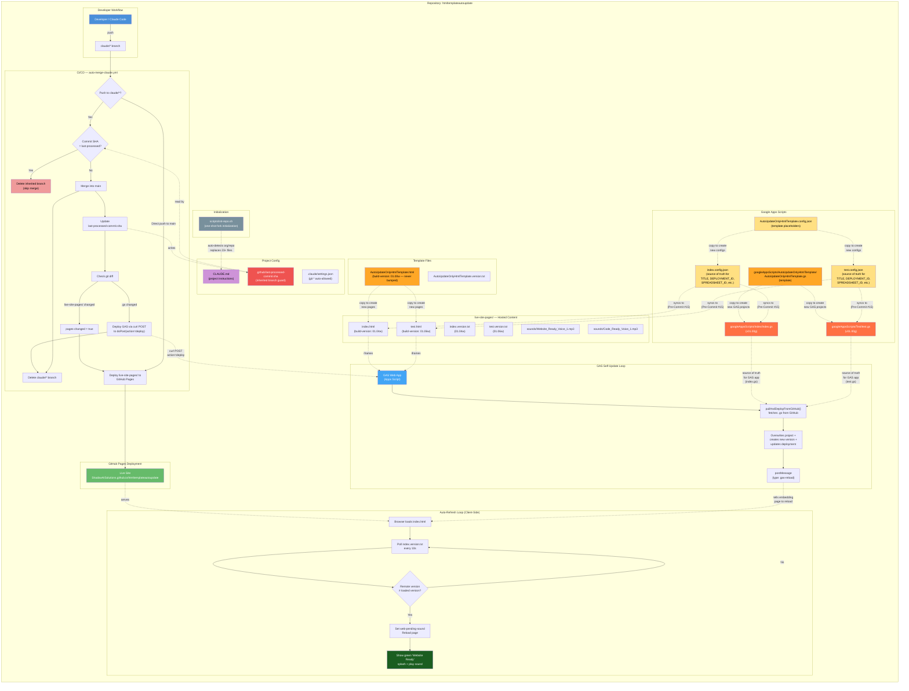

# Project Architecture

```mermaid
graph TB
    subgraph "Repository: htmltemplateautoupdate"
        direction TB

        subgraph "Developer Workflow"
            DEV["Developer / Claude Code"]
            CB["claude/* branch"]
            DEV -->|"push"| CB
        end

        subgraph "CI/CD — auto-merge-claude.yml"
            direction TB
            TRIGGER{"Push to claude/*?"}
            CB --> TRIGGER
            TRIGGER -->|Yes| SHA_CHECK{"Commit SHA\n= last-processed?"}
            SHA_CHECK -->|Yes| DELETE_STALE["Delete inherited branch\n(skip merge)"]
            SHA_CHECK -->|No| MERGE["Merge into main"]
            MERGE --> UPDATE_SHA["Update\nlast-processed-commit.sha"]
            UPDATE_SHA --> DIFF["Check git diff"]
            DIFF -->|"live-site-pages/ changed"| PAGES_FLAG["pages-changed = true"]
            DIFF -->|".gs changed"| GAS_DEPLOY["Deploy GAS via curl POST\nto doPost(action=deploy)"]
            GAS_DEPLOY --> DELETE_BR
            MERGE --> DELETE_BR["Delete claude/* branch"]
            PAGES_FLAG --> DEPLOY_PAGES
            TRIGGER -->|"Direct push to main"| DEPLOY_PAGES
        end

        subgraph "GitHub Pages Deployment"
            DEPLOY_PAGES["Deploy live-site-pages/ to\nGitHub Pages"]
            LIVE["Live Site\nShadowAISolutions.github.io/htmltemplateautoupdate"]
            DEPLOY_PAGES --> LIVE
        end

        subgraph "live-site-pages/ — Hosted Content"
            direction LR
            INDEX["index.html\n(build-version: 01.04w)"]
            VERTXT["index.version.txt\n(01.04w)"]
            TEST["test.html\n(build-version: 01.06w)"]
            TEST_VERTXT["test.version.txt\n(01.06w)"]
            SND1["sounds/Website_Ready_Voice_1.mp3"]
            SND2["sounds/Code_Ready_Voice_1.mp3"]
        end

        subgraph "Auto-Refresh Loop (Client-Side)"
            direction TB
            BROWSER["Browser loads index.html"]
            POLL["Poll index.version.txt\nevery 10s"]
            COMPARE{"Remote version\n≠ loaded version?"}
            RELOAD["Set web-pending-sound\nReload page"]
            SPLASH["Show green 'Website Ready'\nsplash + play sound"]
            BROWSER --> POLL
            POLL --> COMPARE
            COMPARE -->|Yes| RELOAD
            RELOAD --> SPLASH
            COMPARE -->|No| POLL
        end

        subgraph "Google Apps Scripts"
            direction LR
            GAS_INDEX["googleAppsScripts/Index/index.gs\n(v01.00g)"]
            GAS_CFG["index.config.json\n(source of truth for\nTITLE, DEPLOYMENT_ID,\nSPREADSHEET_ID, etc.)"]
            GAS_TEST["googleAppsScripts/Test/test.gs\n(v01.00g)"]
            GAS_TEST_CFG["test.config.json\n(source of truth for\nTITLE, DEPLOYMENT_ID,\nSPREADSHEET_ID, etc.)"]
            GAS_TPL["googleAppsScripts/AutoUpdateOnlyHtmlTemplate/\nAutoUpdateOnlyHtmlTemplate.gs\n(template)"]
            GAS_TPL_CFG["AutoUpdateOnlyHtmlTemplate.config.json\n(template placeholders)"]
        end

        subgraph "GAS Self-Update Loop"
            direction TB
            GAS_APP["GAS Web App\n(Apps Script)"]
            GAS_PULL["pullAndDeployFromGitHub()\nfetches .gs from GitHub"]
            GAS_DEPLOY_STEP["Overwrites project +\ncreates new version +\nupdates deployment"]
            GAS_POSTMSG["postMessage\n{type: gas-reload}"]
            GAS_APP --> GAS_PULL
            GAS_PULL --> GAS_DEPLOY_STEP
            GAS_DEPLOY_STEP --> GAS_POSTMSG
        end

        subgraph "Template Files"
            TPL["AutoUpdateOnlyHtmlTemplate.html\n(build-version: 01.00w — never bumped)"]
            TPL_VER["AutoUpdateOnlyHtmlTemplate.version.txt"]
        end

        subgraph "Project Config"
            CLAUDE_MD["CLAUDE.md\n(project instructions)"]
            SETTINGS[".claude/settings.json\n(git * auto-allowed)"]
            SHA_FILE[".github/last-processed-commit.sha\n(inherited branch guard)"]
        end

        subgraph "Initialization"
            INIT_SCRIPT["scripts/init-repo.sh\n(one-shot fork initialization)"]
            INIT_SCRIPT -.->|"auto-detects org/repo\nreplaces 23+ files"| CLAUDE_MD
        end
    end

    TPL -.->|"copy to create\nnew pages"| INDEX
    TPL -.->|"copy to create\nnew pages"| TEST
    GAS_TPL -.->|"copy to create\nnew GAS projects"| GAS_INDEX
    GAS_TPL -.->|"copy to create\nnew GAS projects"| GAS_TEST
    GAS_TPL_CFG -.->|"copy to create\nnew configs"| GAS_CFG
    GAS_TPL_CFG -.->|"copy to create\nnew configs"| GAS_TEST_CFG
    GAS_CFG -.->|"syncs to\n(Pre-Commit #15)"| GAS_INDEX
    GAS_CFG -.->|"syncs to\n(Pre-Commit #15)"| INDEX
    GAS_TEST_CFG -.->|"syncs to\n(Pre-Commit #15)"| GAS_TEST
    GAS_TEST_CFG -.->|"syncs to\n(Pre-Commit #15)"| TEST
    LIVE -.->|"serves"| BROWSER
    INDEX -.->|"iframes"| GAS_APP
    TEST -.->|"iframes"| GAS_APP
    GAS_POSTMSG -.->|"tells embedding\npage to reload"| BROWSER
    GAS_INDEX -.->|"source of truth\nfor GAS app\n(index.gs)"| GAS_PULL
    GAS_TEST -.->|"source of truth\nfor GAS app\n(test.gs)"| GAS_PULL
    GAS_DEPLOY -.->|"curl POST\naction=deploy"| GAS_APP
    SHA_FILE -.->|"read by"| SHA_CHECK
    UPDATE_SHA -.->|"writes"| SHA_FILE

    style DEV fill:#4a90d9,color:#fff
    style LIVE fill:#66bb6a,color:#fff
    style SHA_FILE fill:#ef5350,color:#fff
    style DELETE_STALE fill:#ef9a9a,color:#000
    style SPLASH fill:#1b5e20,color:#fff
    style TPL fill:#ffa726,color:#000
    style GAS_INDEX fill:#ff7043,color:#fff
    style GAS_TEST fill:#ff7043,color:#fff
    style GAS_TPL fill:#ffa726,color:#000
    style GAS_CFG fill:#ffe082,color:#000
    style GAS_TEST_CFG fill:#ffe082,color:#000
    style GAS_TPL_CFG fill:#ffe082,color:#000
    style GAS_APP fill:#42a5f5,color:#fff
    style CLAUDE_MD fill:#ce93d8,color:#000
    style INIT_SCRIPT fill:#78909c,color:#fff
```

Developed by: ShadowAISolutions
